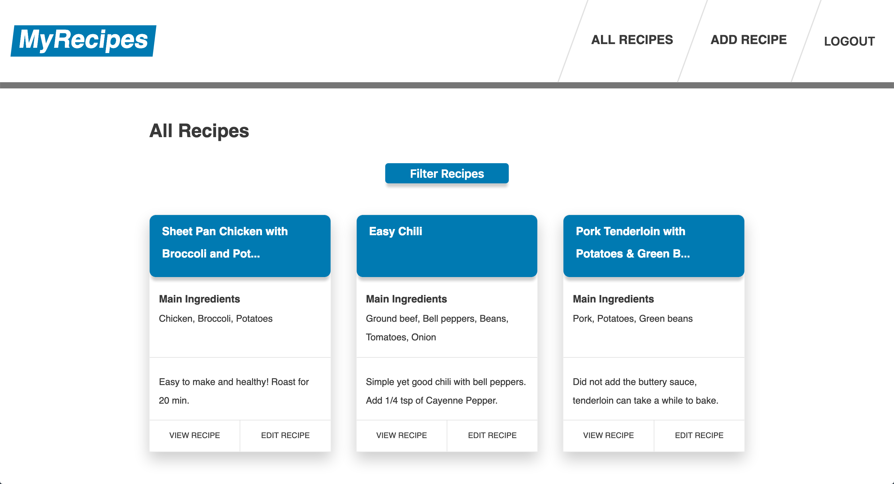

# MyRecipes



MyRecipes is a MeteorJS application for food recipes. Specifically, it lets you keep track of recipes that you have made before, as well as filter for certain kinds of recipes based on title or tags. I kept losing track of recipes that I found online and enjoyed, so I made a website to store that information for later.

## Getting Started

These instructions will get you a copy of the project up and running on your local machine for development and testing purposes. See deployment for notes on how to deploy the project on a live system.

### Prerequisites

You'll need the following to run this app locally:

1. [Git](https://git-scm.com/)

* For instructions on installing Git, [go here](https://git-scm.com/book/en/v2/Getting-Started-Installing-Git)

2. [Node.js](https://nodejs.org/en/)

* You can install Node.js on the [homepage](https://nodejs.org/en/)

3. [MeteorJS](https://www.meteor.com/)

* On OSX/Linux, run: `curl https://install.meteor.com/ | sh`

* On Windows, first install [Chocolatey](https://chocolatey.org/install), then run: `choco install meteor`

### Installing

Run the following commands in your terminal to install & use MyRecipes on `localhost:3000` in your browser:

1. `git clone https://github.com/benjimorr/my-recipes.git`
2. `cd my-recipes`
3. `npm install`
4. `npm start`

Visit [`localhost:3000`](http://localhost:3000) to use the website.

## Deployment

If you wish to deploy this application, you can follow these steps to host it on Heroku:

1. Install the Heroku CLI [here](https://devcenter.heroku.com/articles/heroku-cli#download-and-install)
2. Create an app on Heroku

```bash
heroku login
heroku apps:create my-recipes
```

3. Set a Meteor buildpack for your Heroku instance

```bash
heroku buildpacks:set https://github.com/AdmitHub/meteor-buildpack-horse.git
```

4. Create a new mLab instance (sandbox tier, free of charge)

```bash
heroku addons:create mongolab:sandbox
```

5. Get your MongoLab URI

```bash
heroku config | grep MONGODB_URI
```

6. Set the configurations of your Meteor app running on Heroku

```bash
heroku config:add MONGO_URL=<MONGODB_URI value>
heroku config:add ROOT_URL=https://my-recipes.herokuapp.com
```

7. Check your git remotes to ensure heroku is there

```bash
git remote -v

// The output should look like this
heroku https://git.heroku.com/my-recipes.git (fetch)
heroku https://git.heroku.com/my-recipes.git (push)
```

8. Deploy the app

```bash
git push heroku master
```

## Built With

* [React 16](https://reactjs.org/docs/getting-started.html)
* [Meteor 1.8](https://docs.meteor.com/)
* [React Router 5](https://www.npmjs.com/package/react-router)
* [Simpl Schema 1.5](https://www.npmjs.com/package/simpl-schema)
* [Styled Components 4.1](https://www.styled-components.com/docs)

## License

This project is licensed under the MIT License - see the [LICENSE.md](./LICENSE.md) file for details.
